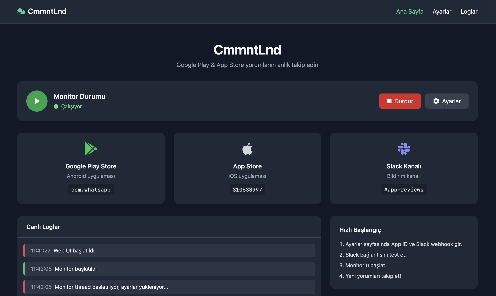
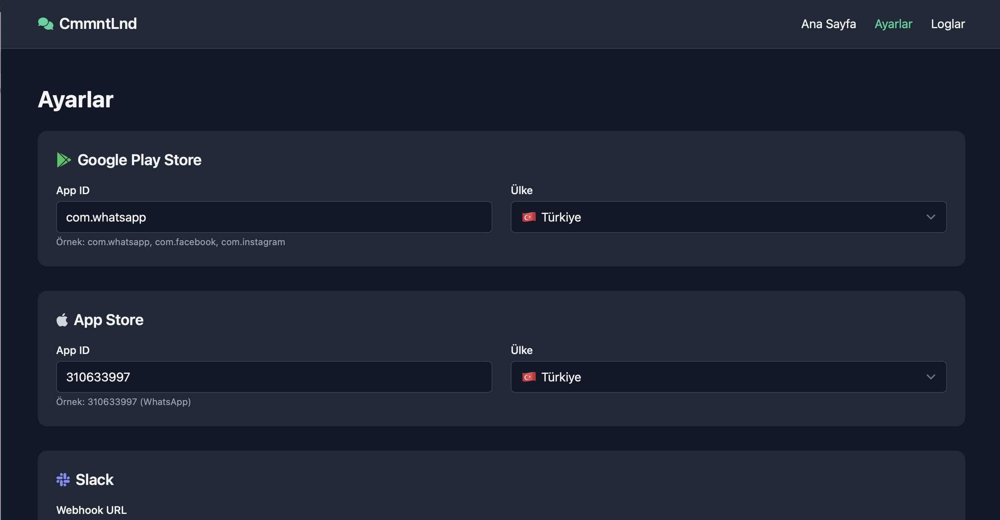

# 📱 CmmntLnd (CommentLand)

App Store ve Google Play Store'daki uygulama yorumlarını otomatik olarak takip eden ve yeni yorumları Slack'e gönderen Python uygulaması.

## 📸 Ekran Görüntüleri

<div align="center">
  
  <p><em>Ana Dashboard - Monitor durumu ve platform bilgileri</em></p>
</div>

<div align="center">
  
  <p><em>Ayarlar Sayfası - App ID'leri ve Slack webhook konfigürasyonu</em></p>
</div>

### 📸 Ekran Görüntüleri Nasıl Alınır?

Ekran görüntülerini almak için:

```bash
# Demo verileri oluştur
python3 demo_screenshots.py

# Web UI'yi başlat
python3 web_ui.py

# Tarayıcıda http://localhost:5000 adresine git
# Ekran görüntülerini al ve assets/screenshots/ klasörüne kaydet
```

## ✨ Özellikler

- 🍎 **App Store** yorumlarını takip eder
- 🤖 **Google Play Store** yorumlarını takip eder
- 💬 **Slack** entegrasyonu ile anlık bildirimler
- 🌐 **Web UI** ile kolay yapılandırma
- 🎨 **Modern arayüz** (Apple Design System benzeri)
- ⏰ **Otomatik** periyodik kontrol
- 🌍 **Çoklu ülke** desteği
- 📊 **Detaylı loglar** ve izleme
- 📈 **Database Export** - Geçmiş yorumları CSV/JSON olarak export
- 🔍 **Data Science Ready** - Analiz için optimize edilmiş veri yapısı

## 🚀 Hızlı Başlangıç

### Gereksinimler

- Python 3.8+
- pip3
- Slack Webhook URL

### Kurulum

#### Otomatik Kurulum (Önerilen)

**Linux/macOS:**
```bash
git clone https://github.com/yunusemreyildiz/cmmntlnd.git
cd cmmntlnd
./install.sh
```

**Windows:**
```cmd
git clone https://github.com/yunusemreyildiz/cmmntlnd.git
cd cmmntlnd
install.bat
```

#### Manuel Kurulum

1. **Bağımlılıkları yükleyin:**
```bash
pip3 install -r requirements.txt
```

2. **Konfigürasyon dosyasını oluşturun:**
```bash
cp env_example.txt .env
```

3. **Ayarlarınızı düzenleyin:**
`.env` dosyasını açın ve gerekli bilgileri girin.

## ⚙️ Konfigürasyon

### .env Dosyası Ayarları

```env
# Slack Configuration
SLACK_WEBHOOK_URL=https://hooks.slack.com/services/YOUR/SLACK/WEBHOOK
SLACK_CHANNEL=#app-reviews

# App Store Configuration
APP_STORE_APP_ID=1234567890
APP_STORE_COUNTRY=all

# Google Play Configuration
GOOGLE_PLAY_APP_ID=com.whatsapp
GOOGLE_PLAY_COUNTRY=all

# Monitor Configuration
CHECK_INTERVAL_MINUTES=60
MAX_REVIEWS_PER_CHECK=10
```

### App ID'leri Nasıl Bulunur?

#### App Store App ID
1. App Store'da uygulamanızı bulun
2. URL'deki sayıyı kopyalayın: `https://apps.apple.com/app/whatsapp-messenger/id310633997`
3. `310633997` kısmını kullanın (WhatsApp'ın App Store ID'si)

#### Google Play App ID
1. Google Play Store'da uygulamanızı bulun
2. URL'deki paket adını kopyalayın: `https://play.google.com/store/apps/details?id=com.whatsapp`
3. `com.whatsapp` kısmını kullanın (WhatsApp'ın Google Play ID'si)

### Slack Webhook Nasıl Oluşturulur?

1. Slack workspace'inizde bir kanal oluşturun
2. [Slack API](https://api.slack.com/messaging/webhooks) sayfasına gidin
3. "Create Webhook" butonuna tıklayın
4. Kanalı seçin ve webhook URL'ini kopyalayın

## 🖥️ Kullanım

### Web UI ile Kullanım (Önerilen)

1. **Web UI'yi başlatın:**
```bash
python3 web_ui.py
```

2. **Tarayıcınızda açın:**
```
http://localhost:5000
```

3. **Ayarlarınızı yapın:**
   - Settings sayfasından gerekli bilgileri girin
   - Slack webhook'unuzu test edin
   - Monitor'u başlatın

### Komut Satırı ile Kullanım

```bash
python3 main.py
```

### 📊 Database Export ile Kullanım

1. **Database sayfasına gidin:**
```
http://localhost:5000/database
```

2. **Zaman aralığı seçin:**
   - Son 15 gün
   - Son 1 ay
   - Son 2 ay
   - Son 3 ay
   - Son 6 ay
   - Son 1 yıl

3. **Export formatını seçin:**
   - CSV (Excel uyumlu)
   - JSON (API uyumlu)

4. **Platform seçimi:**
   - iOS (App Store)
   - Android (Google Play)
   - Her ikisi

5. **Export butonuna tıklayın** ve dosyayı indirin

#### 📈 Data Science Analizi İçin CSV Yapısı

```csv
Platform,Review ID,Rating,Title,Content,Author,Date,Version,URL,Country
Google Play,review_123,5,Harika uygulama,Çok beğendim,Ahmet,2024-01-15,1.2.3,https://...,tr
App Store,review_456,4,İyi,Genel olarak iyi,Mehmet,2024-01-14,1.2.3,https://...,tr
```

#### 🔍 Analiz İmkanları

- **Sentiment Analysis**: Yorum metinlerinde duygu analizi
- **Rating Trends**: Zaman içinde puan değişimleri
- **Platform Comparison**: iOS vs Android karşılaştırması
- **Topic Modeling**: Yorumlarda konu analizi
- **Version Analysis**: App versiyonlarına göre geri bildirim analizi

#### 📊 Platform Kapasitesi

- **Google Play**: Pagination ile 2000+ yorum çekilebilir (500 yorum/sayfa)
- **App Store**: Pagination ile 1000+ yorum çekilebilir (50 yorum/sayfa)
- **Pagination**: Her iki platformda da sayfa sayfa geriye giderek belirtilen tarihe kadar yorum
- **Rate Limiting**: Platform limitlerini aşmamak için sayfa başına 1-2 saniye bekleme
- **Tarih Doğruluğu**: Seçilen zaman aralığına tam olarak uygun veri çekimi

## 📁 Proje Yapısı

```
app-review-monitor/
├── app_review_monitor.py    # Ana monitor sınıfı
├── web_ui.py               # Web arayüzü
├── config.py               # Konfigürasyon yönetimi
├── main.py                 # Komut satırı giriş noktası
├── requirements.txt        # Python bağımlılıkları
├── install.sh             # Linux/macOS kurulum scripti
├── install.bat            # Windows kurulum scripti
├── env_example.txt        # Örnek konfigürasyon
├── templates/             # Web UI şablonları
│   ├── base.html
│   ├── index.html
│   └── settings.html
└── README.md              # Bu dosya
```

## 🔧 Gelişmiş Ayarlar

### Kontrol Aralığı
- `CHECK_INTERVAL_MINUTES`: Dakika cinsinden kontrol aralığı (1-1440)
- Varsayılan: 60 dakika

### Maksimum Yorum Sayısı
- `MAX_REVIEWS_PER_CHECK`: Her kontrol sırasında işlenecek maksimum yorum sayısı (1-100)
- Varsayılan: 10 yorum

### Ülke Seçimi
- `all`: Tüm ülkelerden yorumları alır
- `tr`: Sadece Türkiye'den yorumları alır
- `us`: Sadece ABD'den yorumları alır
- `gb`: Sadece İngiltere'den yorumları alır

## 🐳 Docker ile Kullanım

```bash
# Docker image oluştur
docker build -t app-review-monitor .

# Container çalıştır
docker run -p 5000:5000 -v $(pwd)/.env:/app/.env app-review-monitor
```

## 📊 Loglar ve İzleme

- **Web UI**: `http://localhost:5000/logs` - Canlı logları görüntüle
- **Dosya logları**: `logs/` dizininde saklanır
- **Sent reviews**: `sent_reviews.json` - Gönderilen yorumların listesi
- **Last check**: `last_check.json` - Son kontrol zamanları

## 🚨 Sorun Giderme

### Yaygın Sorunlar

1. **"Module not found" hatası:**
   ```bash
   pip3 install -r requirements.txt
   ```

2. **Slack webhook çalışmıyor:**
   - Webhook URL'ini kontrol edin
   - Slack kanalının var olduğundan emin olun
   - Webhook'un aktif olduğunu kontrol edin

3. **App ID bulunamıyor:**
   - App Store/Google Play'de uygulamanın yayında olduğundan emin olun
   - App ID'lerin doğru olduğunu kontrol edin

4. **Yorumlar gelmiyor:**
   - İnternet bağlantınızı kontrol edin
   - App Store/Google Play API limitlerini kontrol edin
   - Logları inceleyin

### Debug Modu

```bash
# Debug modunda çalıştır
FLASK_DEBUG=1 python3 web_ui.py
```

## 🔧 Sorun Giderme

### Kurulum Sorunları

#### Dependency Conflict Hatası
Eğer `ResolutionImpossible` hatası alıyorsanız:

```bash
# Sanal ortam oluşturun
python3 -m venv venv
source venv/bin/activate  # Linux/macOS
# veya
venv\Scripts\activate.bat  # Windows

# pip'i güncelleyin
pip install --upgrade pip

# Bağımlılıkları tek tek yükleyin
pip install requests>=2.23.0,<3.0.0
pip install python-dotenv
pip install flask
pip install google-play-scraper
pip install app-store-scraper
pip install slack-sdk
```

#### Python Versiyonu Sorunları
Python 3.8+ gereklidir:
```bash
python3 --version  # 3.8+ olmalı
```

#### macOS ARM64 Sorunları
Apple Silicon Mac'lerde:
```bash
# Homebrew ile Python yükleyin
brew install python@3.11
python3.11 -m venv venv
source venv/bin/activate
```

### Çalışma Sorunları

#### Monitor Başlamıyor
- `.env` dosyasının doğru yapılandırıldığından emin olun
- Slack webhook URL'sinin geçerli olduğunu kontrol edin
- App ID'lerin doğru olduğunu doğrulayın

#### Slack Mesajları Gelmiyor
- Webhook URL'sini test edin
- Kanal adının doğru olduğunu kontrol edin
- Slack workspace'inizde bot izinlerini kontrol edin

## 🤝 Katkıda Bulunma

1. Fork yapın
2. Feature branch oluşturun (`git checkout -b feature/amazing-feature`)
3. Commit yapın (`git commit -m 'Add amazing feature'`)
4. Push yapın (`git push origin feature/amazing-feature`)
5. Pull Request oluşturun

## 📝 Lisans

Bu proje MIT lisansı altında lisanslanmıştır. Detaylar için `LICENSE` dosyasına bakın.

## 🙏 Teşekkürler

- [google-play-scraper](https://github.com/JoMingyu/google-play-scraper) - Google Play Store scraping
- [app-store-scraper](https://github.com/cowboy-bebug/app-store-scraper) - App Store scraping
- [Flask](https://flask.palletsprojects.com/) - Web framework
- [Slack API](https://api.slack.com/) - Slack entegrasyonu

## 📞 Destek

Sorunlarınız için:
- GitHub Issues açın
- Dokümantasyonu kontrol edin
- Logları inceleyin

---

**⭐ Bu projeyi beğendiyseniz yıldız vermeyi unutmayın!**