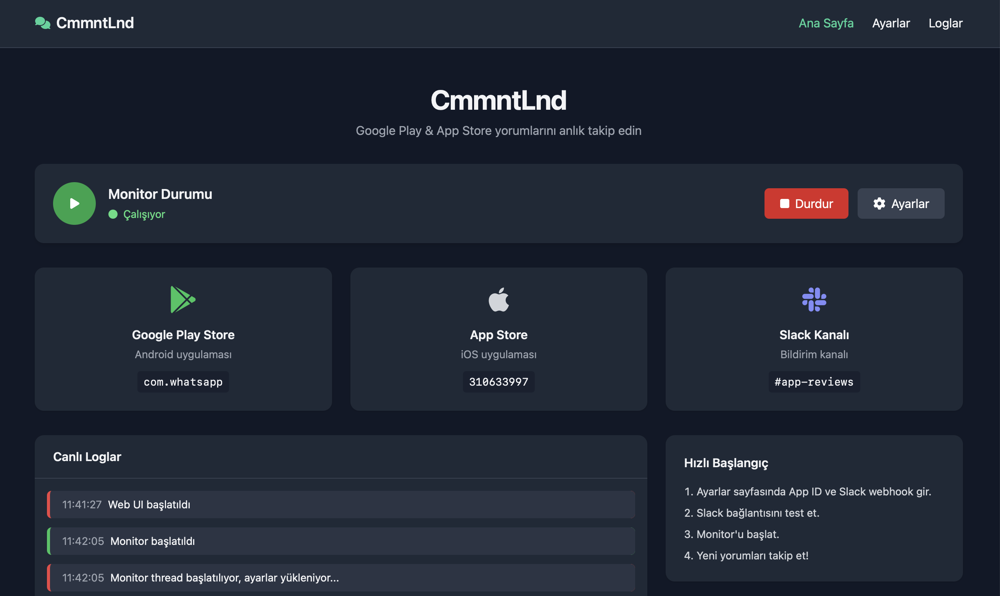
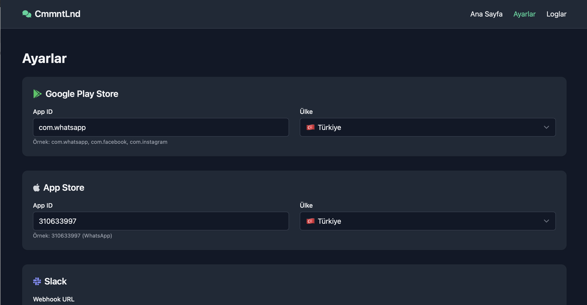

# 📱 CmmntLnd (CommentLand)

> **App Store & Google Play review monitor that sends new app reviews to Slack in real time.** A self-hosted, open-source comment tracker / review tracker with a web UI — instant review notifications, daily rating summaries with trends, SQLite storage, and CSV/JSON export.

CmmntLnd automatically tracks reviews from the Apple App Store and Google Play Store and posts new reviews to Slack as they arrive.

**Keywords:** app review monitor · app store reviews to slack · google play reviews to slack · comment tracker · review tracker · slack review notifications · app rating monitor · mobile app review alerts · store comment notifier · app-store-scraper · google-play-scraper · flask · python

## 📸 Screenshots

<div align="center">
  
  <p><em>Main dashboard — monitor status and platform info</em></p>
</div>

<div align="center">
  
  <p><em>Settings page — app IDs and Slack webhook configuration</em></p>
</div>

## ✨ Features

- 🍎 Tracks **App Store** reviews
- 🤖 Tracks **Google Play Store** reviews
- 💬 **Slack** integration for instant notifications
- 🗄️ **SQLite database** — all reviews and daily stats are stored persistently (no duplicate notifications)
- 📅 **Daily Slack summary** — average rating, vote count, and day-over-day change (🟢/🔴 trend) every day
- 🌐 **Web UI** for easy configuration
- 🎨 **Modern interface** (Tailwind CSS)
- ⏰ **Automatic** periodic checks
- 🌍 **Multi-country** support
- 📊 **Detailed logs** and monitoring
- 📈 **Database export** — export historical reviews as CSV/JSON
- 🔍 **Filterable review table** — search by platform, rating, and text + pagination

## 🚀 Quick Start

### Requirements

- Python 3.8+
- pip3
- A Slack Webhook URL

### Installation

#### Automatic Installation (Recommended)

**Linux/macOS:**
```bash
git clone https://github.com/yunusemreyildiz/cmmntlnd.git
cd cmmntlnd
./install.sh
```

**Windows:**
```cmd
git clone https://github.com/yunusemreyildiz/cmmntlnd.git
cd cmmntlnd
install.bat
```

#### Manual Installation

1. **Install dependencies:**
```bash
pip3 install -r requirements.txt
```

2. **Create the configuration file:**
```bash
cp env_example.txt .env
```

3. **Edit your settings:** open `.env` and fill in the required values.

## ⚙️ Configuration

### .env Settings

```env
# Slack Configuration
SLACK_WEBHOOK_URL=https://hooks.slack.com/services/YOUR/SLACK/WEBHOOK
SLACK_CHANNEL=#app-reviews

# App Store Configuration
APP_STORE_APP_ID=1234567890
APP_STORE_COUNTRY=all

# Google Play Configuration
GOOGLE_PLAY_APP_ID=com.whatsapp
GOOGLE_PLAY_COUNTRY=all

# Monitor Configuration
CHECK_INTERVAL_MINUTES=60
MAX_REVIEWS_PER_CHECK=10

# Time of day to send the daily Slack summary (HH:MM, default 10:00)
DAILY_SUMMARY_TIME=10:00
```

### How to Find App IDs

#### App Store App ID
1. Find your app on the App Store
2. Copy the number from the URL: `https://apps.apple.com/app/whatsapp-messenger/id310633997`
3. Use the `310633997` part (WhatsApp's App Store ID)

#### Google Play App ID
1. Find your app on the Google Play Store
2. Copy the package name from the URL: `https://play.google.com/store/apps/details?id=com.whatsapp`
3. Use the `com.whatsapp` part (WhatsApp's Google Play ID)

### How to Create a Slack Webhook

1. Create a channel in your Slack workspace
2. Go to the [Slack API](https://api.slack.com/messaging/webhooks) page
3. Click "Create Webhook"
4. Select the channel and copy the webhook URL

## 🖥️ Usage

### Using the Web UI (Recommended)

1. **Start the Web UI:**
```bash
python3 web_ui.py
```

2. **Open it in your browser:**
```
http://localhost:5000
```

3. **Configure:**
   - Enter the required values on the Settings page
   - Test your Slack webhook
   - Start the monitor

### Using the Command Line

```bash
python3 main.py
```

### 📅 Daily Slack Summary

While the monitor is running, a summary is automatically posted to Slack every day at the configured time (`DAILY_SUMMARY_TIME`, default 10:00):

- Average rating and total vote count for 🍎 iOS and 🤖 Android
- Day-over-day change indicator: 🟢 up, 🔴 down, ➡️ unchanged

The summary is sent only once per day (the state is tracked in the database, so it is never sent twice on the same day). It can also be triggered manually with the **"Send Daily Summary to Slack"** button on the Database page.

### 📊 Database Export

1. **Go to the Database page:**
```
http://localhost:5000/database
```

2. **Pick a time range:**
   - Last 15 days
   - Last 1 month
   - Last 2 months
   - Last 3 months
   - Last 6 months
   - Last 1 year

3. **Choose an export format:**
   - CSV (Excel-friendly)
   - JSON (API-friendly)

4. **Select platforms:**
   - iOS (App Store)
   - Android (Google Play)
   - Both

5. **Click Export** and download the file

#### 📈 CSV Structure for Data Analysis

```csv
Platform,Review ID,Rating,Title,Content,Author,Date,Version,URL,Country
Google Play,review_123,5,Great app,Loved it,Ahmet,2024-01-15,1.2.3,https://...,tr
App Store,review_456,4,Good,Generally good,Mehmet,2024-01-14,1.2.3,https://...,tr
```

#### 🔍 Analysis Possibilities

- **Sentiment Analysis**: emotion analysis on review text
- **Rating Trends**: rating changes over time
- **Platform Comparison**: iOS vs Android
- **Topic Modeling**: topic analysis across reviews
- **Version Analysis**: feedback broken down by app version

#### 📊 Platform Capacity

- **Google Play**: 2000+ reviews via pagination (500 reviews/page)
- **App Store**: 1000+ reviews via pagination (50 reviews/page)
- **Pagination**: both platforms page backwards until the requested date
- **Rate Limiting**: 1–2 seconds wait per page to stay within platform limits
- **Date Accuracy**: data fetched precisely for the selected time range

## 📁 Project Structure

```
cmmntlnd/
├── app_review_monitor.py   # Core monitor class (review fetching, Slack, stats)
├── database.py             # SQLite layer (reviews + daily stats)
├── web_ui.py               # Web interface (Flask)
├── config.py               # Configuration management
├── main.py                 # Command-line entry point
├── requirements.txt        # Python dependencies
├── install.sh              # Linux/macOS install script
├── install.bat             # Windows install script
├── env_example.txt         # Example configuration
├── Dockerfile              # Docker image
├── docker-compose.yml      # Docker Compose configuration
├── templates/              # Web UI templates (Tailwind CSS)
│   ├── base_tw.html        # Shared layout
│   ├── index.html          # Home / monitor status
│   ├── settings.html       # Settings
│   └── database.html       # Database: stats, export, review table
└── README.md               # This file
```

> Note: `reviews.db` (SQLite) is created automatically on first run and is kept out of version control via `.gitignore`.

## 🔧 Advanced Settings

### Check Interval
- `CHECK_INTERVAL_MINUTES`: check interval in minutes (1–1440)
- Default: 60 minutes

### Maximum Reviews
- `MAX_REVIEWS_PER_CHECK`: maximum reviews processed per check (1–100)
- Default: 10 reviews

### Country Selection
- `all`: reviews from all countries
- `tr`: reviews from Turkey only
- `us`: reviews from the US only
- `gb`: reviews from the UK only

## 🐳 Using Docker

```bash
# Build the Docker image
docker build -t app-review-monitor .

# Run the container
docker run -p 5000:5000 -v $(pwd)/.env:/app/.env app-review-monitor
```

## 📊 Logs & Monitoring

- **Web UI**: `http://localhost:5000/logs` — view live logs
- **File logs**: stored in the `logs/` directory
- **Database**: `reviews.db` (SQLite) — all reviews, send status, and daily stats are stored here
- **Database page**: `http://localhost:5000/database` — view stats, browse stored reviews, and export

## 🚨 Troubleshooting

### Common Issues

1. **"Module not found" error:**
   ```bash
   pip3 install -r requirements.txt
   ```

2. **Slack webhook not working:**
   - Check the webhook URL
   - Make sure the Slack channel exists
   - Verify the webhook is active

3. **App ID not found:**
   - Make sure the app is published on the App Store/Google Play
   - Verify the app IDs are correct

4. **No reviews coming in:**
   - Check your internet connection
   - Check App Store/Google Play API limits
   - Inspect the logs

### Debug Mode

```bash
# Run in debug mode
FLASK_DEBUG=1 python3 web_ui.py
```

### Installation Issues

#### Dependency Conflict Error
If you get a `ResolutionImpossible` error:

```bash
# Create a virtual environment
python3 -m venv venv
source venv/bin/activate  # Linux/macOS
# or
venv\Scripts\activate.bat  # Windows

# Upgrade pip
pip install --upgrade pip

# Install dependencies one by one
pip install requests>=2.23.0,<3.0.0
pip install python-dotenv
pip install flask
pip install google-play-scraper
pip install app-store-scraper
pip install slack-sdk
```

#### Python Version Issues
Python 3.8+ is required:
```bash
python3 --version  # must be 3.8+
```

#### macOS ARM64 Issues
On Apple Silicon Macs:
```bash
# Install Python with Homebrew
brew install python@3.11
python3.11 -m venv venv
source venv/bin/activate
```

### Runtime Issues

#### Monitor Won't Start
- Make sure `.env` is configured correctly
- Verify the Slack webhook URL is valid
- Confirm the app IDs are correct

#### Slack Messages Not Arriving
- Test the webhook URL
- Check that the channel name is correct
- Check bot permissions in your Slack workspace

## 🤝 Contributing

1. Fork the repository
2. Create a feature branch (`git checkout -b feature/amazing-feature`)
3. Commit your changes (`git commit -m 'Add amazing feature'`)
4. Push the branch (`git push origin feature/amazing-feature`)
5. Open a Pull Request

## 📝 License

This project is licensed under the MIT License. See the `LICENSE` file for details.

## 🙏 Acknowledgements

- [google-play-scraper](https://github.com/JoMingyu/google-play-scraper) — Google Play Store scraping
- [app-store-scraper](https://github.com/cowboy-bebug/app-store-scraper) — App Store scraping
- [Flask](https://flask.palletsprojects.com/) — web framework
- [Slack API](https://api.slack.com/) — Slack integration

## 📞 Support

For issues:
- Open a GitHub Issue
- Check the documentation
- Inspect the logs

---

**⭐ If you like this project, don't forget to give it a star!**
